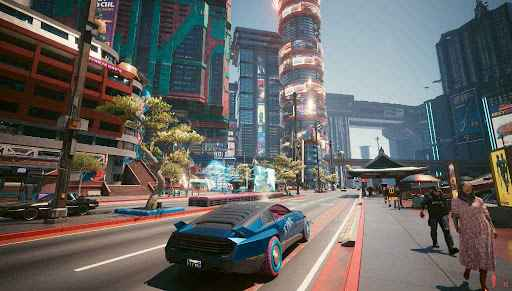

# Visualizing Hue: A Journey Through the Color Spectrum & Cyberpunk Complexity




# Scale of Complexity, To Put Things Into Perspective ... 

 The sheer volume of particles and lines of code required to render a scene like the Cyberpunk 2077 screenshot is immense. If each particle or line of code were a grain of sand, it would be enough to fill the entirety Jones Beach on Long Island, New York

 **(Roughly 10 * 10,000,000,000 cubic feet of sand, or 10 billion cubic feet.)**


This repository explores the concept of hue in physics and computer graphics through Python visualizations. We delve into the mathematical foundations of hue, its conversion to RGB, and its diverse applications, while also touching upon the immense computational complexity behind modern graphics like the Cyberpunk 2077 screenshot.

## Introduction

Hue, a fundamental attribute of color, describes the pure color tone. This project visualizes the hue spectrum in three distinct ways: a circular gradient, a horizontal wave, and a linear gradient. We aim to provide an intuitive understanding of hue's cyclical nature and its representation in different color models, and then contrast this simplicity with the complexity of modern game graphics.

## Mathematical Foundations

### HSV to RGB Conversion

The core of our visualizations relies on converting hue values (part of the HSV color model) into RGB values. The conversion involves a series of conditional steps:

1.  **Intermediate Values:**
    * $C = V \times S$ (Chroma)
    * $X = C \times (1 - |(H \times 6) \mod 2 - 1|)$
    * $m = V - C$

2.  **RGB Based on Hue Sector:**
    * If $0 \le H < \frac{1}{6}$: $(R', G', B') = (C, X, 0)$
    * If $\frac{1}{6} \le H < \frac{2}{6}$: $(R', G', B') = (X, C, 0)$
    * If $\frac{2}{6} \le H < \frac{3}{6}$: $(R', G', B') = (0, C, X)$
    * If $\frac{3}{6} \le H < \frac{4}{6}$: $(R', G', B') = (0, X, C)$
    * If $\frac{4}{6} \le H < \frac{5}{6}$: $(R', 0, C)$
    * If $\frac{5}{6} \le H < 1$: $(C, 0, X)$

3.  **Final RGB Values:**
    * $R = R' + m$
    * $G = G' + m$
    * $B = B' + m$

### Visualization Equations

* **Circular Spectrum:**
    * $x = r \times \cos(\theta)$
    * $y = r \times \sin(\theta)$
    * $\theta = 2\pi \times H$

* **Wave Spectrum:**
    * $y = A \times \sin(x)$

* **Gradient Spectrum:**
    * $H = \frac{x}{width}$

## Visualizations

### Circular Spectrum


This visualization represents the hue spectrum as a circular gradient, emphasizing its cyclical nature.

### Wave Spectrum


This visualization displays the hue spectrum as a horizontal wave, showcasing the smooth progression of hues.

### Gradient Spectrum


This visualization presents the hue spectrum as a linear gradient, a common representation in various applications.

## Applications and Significance

* **Computer Graphics and Digital Imaging:** Hue is essential for color selection, correction, and special effects.
* **Web Design and UI Design:** Hue is used to create visually appealing and consistent color schemes.
* **Color Printing and Textile Design:** Hue control ensures accurate color reproduction.
* **Scientific Visualization:** Hue represents data values in heatmaps and topographic maps.
* **Colorimetry and Color Science:** Hue is a fundamental parameter in color measurement and standardization.

## The Complexity of Cyberpunk-Level Graphics

Generating a realistic image like the Cyberpunk 2077 screenshot involves a staggering amount of computation. To illustrate:

* **Geometric Detail:** Millions of polygons are used for detailed 3D models.
* **Lighting:** Complex algorithms like Phong shading and path tracing simulate realistic light.
* **Texturing:** High-resolution textures are mapped onto surfaces.
* **Post-Processing:** Effects like depth of field and motion blur enhance realism.

**Math Example: Ray-Triangle Intersection**

The Möller-Trumbore algorithm, used for ray tracing, involves solving equations like:

$O + tD = (1 - u - v)V_0 + uV_1 + vV_2$

Where:

* $O$ is the ray origin.
* $D$ is the ray direction.
* $V_0, V_1, V_2$ are triangle vertices.
* $t, u, v$ are intersection parameters.

This is just a glimpse of the complex math behind each rendered pixel.

**Estimated Lines of Code (LOC):**

Modern game engines like those used for Cyberpunk 2077 can contain millions of lines of code.

* Rendering Engine: 500,000 - 1,000,000+ LOC
* Game Logic: 1,000,000+ LOC
* Asset Pipeline, Physics, AI, Tools: Hundreds of thousands of LOC each.

This illustrates the sheer scale of software engineering required to create such immersive visuals.

## Neat Facts

* **Circular Perception:** The circular arrangement of hues reflects the human visual system's opponent processing of color.
* **Color Gamut:** Devices have limited color gamuts, impacting the range of reproducible hues.


## Code

The Python code for generating these visualizations is available in this repository.

```python
# Example Snippet from visualize_hue_spectrum()
import numpy as np
import matplotlib.pyplot as plt
import colorsys

# ... (code for hue to rgb and plotting) ...
